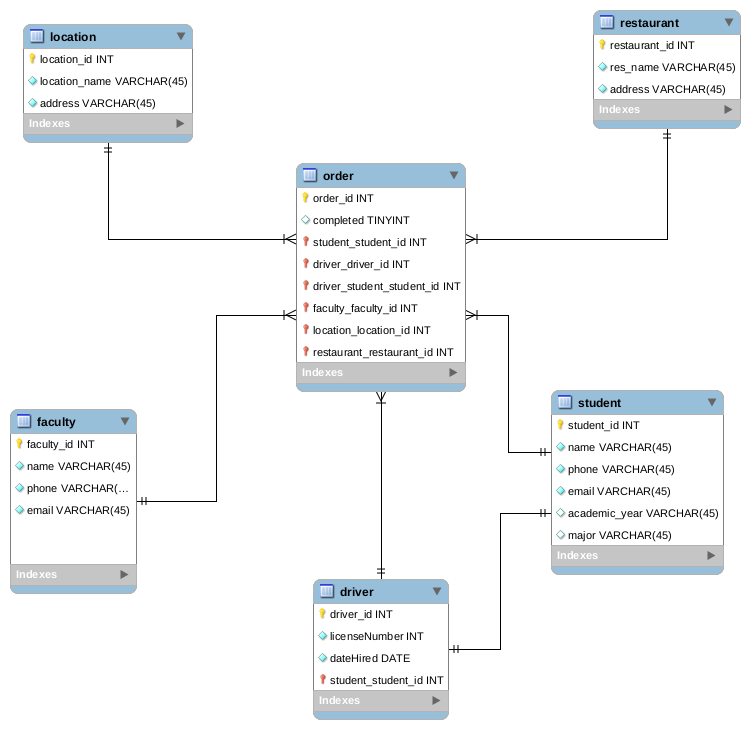

# FoodDelivery3160
Members: Ethan Carter and Seth Schallau
## Introduction
This Food Delivery service is providing a service to universities that works with security and safety procedures. 
A university who purchases a license can run an instance of the application and distribute the app to their students. This will allow faculty to stay in control of who is delivering food on campus, and where that food is coming from. This application will work by allowing students to place an order at a resturant that is signed up with the service. This order will be "confirmed" and payment will be processed once a driver (another student) has accepted the order. These resturants, drivers, and students will all be "approved" users by the university faculty that oversees the operation.

##Deliverable 4 Video: https://www.youtube.com/watch?v=i2xCgC1SwOo&feature=youtu.be

## Use Case
This application will be used by universities that do not want independent contractors on campus, but still desire food delivery service.

## Business Rules
* Drivers must be a student or faculty
* Drivers must be approved by administrators
* Orders will not be confirmed until the driver accepts the order
* Resturants must be approved by administrators
* Administrators may only be faculty, but not all faculty are administrators
* Drop-Off locations must be a University Building
* Each Order must have a recipient, driver, resturant, and drop-off location
* Orders will be marked completed once the driver arrives at the drop-off and completes the order

## EERD

## Data Dictionary

**Student**
| Attribute     | Data type      | Description                          |
| ------------- | -------------- | ------------------------------------ |
| student_id    | int            | ID number                            |
| name          | VARCHAR(45)    | name of student                      |
| phone         | VARCHAR(45)    | contact phone number                 |
| email         | VARCHAR(45)    | email address                        |
| academic_year | VARCHAR(45)    | class standing of student            |
| major         | VARCHAR(45)    | major of Student                     |
                                                                          

**Faculty**
| Attribute     | Data type      | Description                          |
| ------------- | -------------- | ------------------------------------ |
| faculty_id    | int            | ID number                            |
| name          | VARCHAR(45)    | name of faculty member               |
| phone         | VARCHAR(45)    | contact phone number                 |
| email         | VARCHAR(45)    | email address                        |

**Driver**
| Attribute           | Data type      | Description                          |
| ------------------- | -------------- | ------------------------------------ |
| driver_id           | INT            | ID number                            |
| licenseNumber       | VARCHAR(20)    | state issued driver's license number |
| dateHired           | DATE           | date hired by company                |
| student_student_id  | INT            | student ID of student                |

**Order**
| Attribute                      | Data type      | Description                             |
| ------------------------------ | -------------- | --------------------------------------- |
| order_id                       | INT            | order ID number                         |
| completed                      | TINYINT        | completed status of order               |
| student_student_id             | INT            | ID of student belonging to order        |
| driver_driver_id               | INT            | ID of driver belonging to order         |
| driver_student_student_id      | INT            | student ID of driver belonging to order |
| faculty_faculty_id             | INT            | ID of faculty belonging to order        |
| location_location_id           | INT            | ID of location belonging to order       |
| restaurant_restaurant_id       | INT            | ID of restaurant belonging to order     |

**Location**
| Attribute     | Data type      | Description                          |
| ------------- | -------------- | ------------------------------------ |
| location_id   | INT            | ID number                            |
| location_name | VARCHAR(45)    | name of location                     |
| address       | VARCHAR(45)    | address of location                  |

**Restaurant**
| Attribute     | Data type      | Description                          |
| ------------- | -------------- | ------------------------------------ |
| restaurant_id | INT            | ID number                            |
| res_name      | VARCHAR(45)    | name of Restaurant                   |
| address       | VARCHAR(45)    | address of Restaurant                |
                                                                         

## MySQL Queries
In our setup we will be using the usual create table queries. A simple example would be as follows:
1. INSERT INTO 'deliveries' (id, location, dropoff, student, driver, completed) VALUES (1, Cookout, Wallis Hall, Seth, Ethan, no);
2. CREATE TABLE delivieries;
3. UPDATE deliveries WHERE ID == 1 SET completed = yes;

## Trigger
When a new order is submitted to the database a delivery object will be created. When an order is marked completed the delivery should be updated to reflect a successful delivery. When a new establishment is submitted a faculty member of the app should be notified. 

## Stored Procedure

## Future Work
In the future we will need to create a mobile app to pair with our database. Business-wise, we would also like to sell this to companies and modify the student requirement.

## MySQL Dump
Refer to sqlDump Folder
